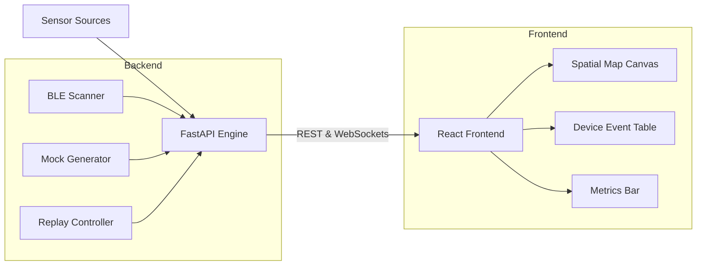

# DeadZone

> Real-time crowd-intelligence platform. **Mock → Replay → Live → Mesh.**

DeadZone is an observability layer for physical spaces. Live crowd density, movement flow, congestion zones, and dead Wi-Fi areas — without attendee apps, accounts, QR codes, or interaction. Passive RF sensing only.

## Features

- **Spatial Intelligence**: Real-time visual heatmaps and drifting device-level particles overlaid on venue floor plans.
- **Multi-Mode Engine**: 
  - `Mock`: Synthetic event generation for guaranteed, repeatable demos.
  - `Replay`: Playback recorded, high-density traffic scenarios (like a stadium ingress or concert exit).
  - `Live (BLE)`: Real-time Bluetooth Low Energy passive scanning and telemetry rendering.
  - `Mesh`: Integration with LoRa relays (Meshtastic) for outdoor or no-Wi-Fi venues.
- **Live Device Telemetry**: Granular observation of sensed MAC hashes, RSSI values, and zone assignments via a WebSocket-powered event stream.
- **Alerting & Diagnostics**: Automated alerts based on density thresholds and real-time mesh link quality.

## Architecture



- **Backend**: Python 3.11, FastAPI, asyncio, WebSockets, Bleak (BLE), Scapy (Wi-Fi passive)
- **Frontend**: React + Vite + TypeScript, custom spatial map (SVG particles)
- **Data Persistence**: Local trace recordings for replay mechanisms.

## Quick Start

### Prerequisites

- macOS (BLE is best-supported here; Linux works for passive Wi-Fi)
- Python 3.11+ and [`uv`](https://docs.astral.sh/uv/) (`brew install uv`)
- Node.js 20+ and `npm`
- **Bluetooth permission** granted to the DeadZone launcher (one-time, see below)

### The two backends

DeadZone runs **two FastAPI services**:

| Service | Port | Started by | Purpose |
|---|---|---|---|
| Main backend | `:8000` | `uv run deadzone-backend` | Dashboard data, BLE scanning, replay engine, mock generator |
| Mesh satellite | `:8001` | `python -m app.mesh satellite` | Multi-laptop mesh: gateway + node + UDP discovery for 1-click join |

The frontend (`:3000`) talks to both via Vite proxies (`/api/v1/*`, `/ws/*` → 8000; `/mesh/*` → 8001).

### Run the full stack (three terminals)

```bash
# Terminal 1 — main backend with real BLE scanning
cd backend
uv run deadzone-backend --port 8000
# First time only: macOS will show a Bluetooth permission dialog. Click ALLOW.
# Subsequent runs are silent — macOS remembers per-bundle.

# Terminal 2 — mesh satellite (gateway + UDP discovery on port 8002)
cd backend
python -m app.mesh satellite

# Terminal 3 — frontend
cd frontend
npm install
npm run dev
```

Open <http://localhost:3000>. Sidebar:
- **Dashboard / Areas / Heatmap / Alerts / Sensors**: real BLE data once you start a capture (POST `/api/v1/capture/start` or click the capture button)
- **Mesh**: click **HOST MESH** to start advertising over UDP. Partner laptops on the same network see your gateway in their **Discovered Gateways** list and can **Join** in one click. Manual-paste fallback if UDP is blocked (firewall, enterprise WiFi). See [`backend/app/mesh/README.md`](backend/app/mesh/README.md) for the full mesh runbook.

### About the BLE launcher (macOS)

The first time you run `uv run deadzone-backend` on macOS, the launcher creates a small app bundle at `backend/.deadzone/DeadZone Bluetooth.app` and re-launches the backend inside it. That bundle has the correct `Info.plist` entitlement (`NSBluetoothAlwaysUsageDescription`) so macOS shows a system prompt:

> **"DeadZone Bluetooth" would like to use Bluetooth.**
> [ Don't Allow ] [ Allow ]

Click **Allow**. macOS remembers this per-app, so future runs are silent. The launched python process binds `:8000` and serves the API.

**Bypass the launcher** (advanced, e.g. CI or non-Mac):
```bash
uv run deadzone-backend --port 8000 --no-macos-bluetooth-app
```
On macOS this will refuse to scan BLE (correctly — CoreBluetooth would SIGABRT the process). On Linux this is fine; bleak uses BlueZ instead.

**Trigger the prompt without starting the server** (one-shot, useful before a demo):
```bash
uv run deadzone-permissions
```
Runs a 3-second scan inside the launcher app just to surface the dialog.

### Common pitfalls

| Symptom | Cause | Fix |
|---|---|---|
| Dashboard shows `Total Devices: 0` and "Local BLE Scanner is not receiving BLE advertisements" | Backend started directly with `uvicorn` instead of via the launcher; or `--no-macos-bluetooth-app` flag set | Stop the backend, restart with `uv run deadzone-backend --port 8000` (no extra flags) |
| `/modes` shows `"ble": "macOS Bluetooth requires the DeadZone permission launcher..."` | Same as above | Same as above |
| Backend crashes immediately on capture start (exit 134 / SIGABRT) | Tried to bypass the launcher with `DEADZONE_MACOS_BLUETOOTH_CHILD=1` but bundle doesn't have permission yet | Launch the canonical way once: `uv run deadzone-backend` and click Allow on the popup |
| MeshPanel shows "mesh request failed (500)" | Mesh satellite isn't running on `:8001` | `cd backend && python -m app.mesh satellite` |
| `/mesh/discover` returns `[]` on a single laptop | macOS doesn't loopback UDP broadcast to localhost | Expected — works on real LAN with two laptops, or use the manual paste fallback |

### Docker (alternative — limited)

```bash
docker compose up
```

This runs the main backend + frontend, but:
- BLE doesn't work inside Docker on macOS (no CoreBluetooth access)
- Mesh satellite is not in the compose file (UDP broadcast inside Docker is fragile on macOS without `network_mode: host`)

So Docker is useful for `Mock` mode and contract testing, not for real BLE or mesh demos. For the full experience use the three-terminal flow above.

## Engineering Principles

- **Deterministic first** — Mock mode produces identical visuals every run; judges need a stable demo
- **Aggregate > Identity** — Never display or transmit device identifiers; only density, motion, pressure
- **Event-driven** — `Sensor Event → Aggregation → Spatial Intelligence` everywhere, so replay/sim/ML reuse one pipe
- **Honest provenance** — Mode badge is persistent and color-coded; mocking is labeled, never hidden

## Repo Layout

- `backend/`: FastAPI application, domain models, runtime engine, and data sources (mock, replay, ble).
- `frontend/`: React components, store management, spatial rendering (`SpatialMap.tsx`), and styles.
- `.lev/`: PM and UX specifications, pipelines, and task plans for the agentic development workflow.

## License

Proprietary — Kingly Agency.
