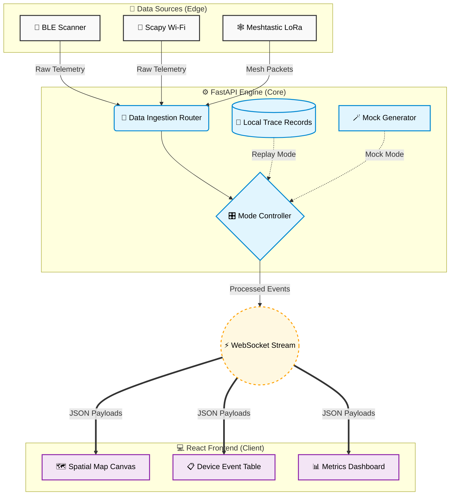
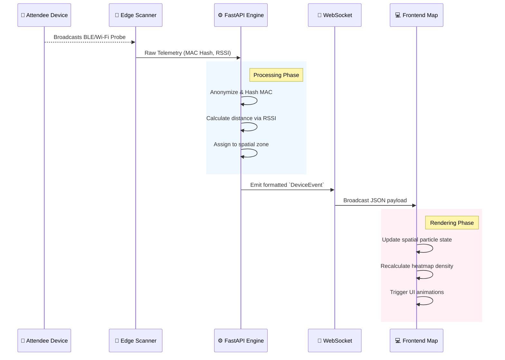
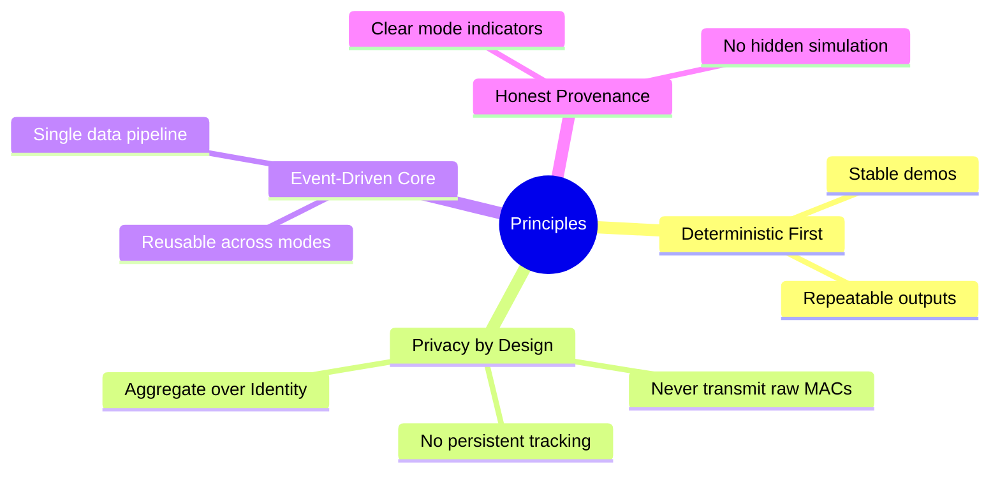

<div align="center">
  <h1>🎯 DeadZone</h1>
  <p><strong>Real-time crowd-intelligence platform. Mock → Replay → Live → Mesh.</strong></p>
  
  <p>
    <a href="#features">Features</a> •
    <a href="#architecture">Architecture</a> •
    <a href="#quick-start">Quick Start</a> •
    <a href="#engineering-principles">Principles</a>
  </p>

  <p>
    
    
    
    
    
  </p>
</div>

<br/>

> **DeadZone** is an observability layer for physical spaces. Live crowd density, movement flow, congestion zones, and dead Wi-Fi areas — without attendee apps, accounts, QR codes, or interaction. Passive RF sensing only.

---

## ✨ Key Features

| Feature | Description |
| :--- | :--- |
| 🗺️ **Spatial Intelligence** | Real-time visual heatmaps and drifting device-level particles overlaid on venue floor plans. |
| 🔄 **Multi-Mode Engine** | Operate seamlessly across `Mock`, `Replay`, `Live (BLE)`, and `Mesh` data sources. |
| 📡 **Live Telemetry** | Granular observation of sensed MAC hashes, RSSI values, and zone assignments via WebSockets. |
| 🚨 **Alerting & Diagnostics** | Automated alerts based on density thresholds and real-time mesh link quality. |

---

## 🏗️ Architecture

DeadZone is built on a modern, decoupled architecture designed for high throughput and low-latency rendering of spatial data.

### System Topology



### Data Flow Sequence

How a device ping is processed and visualized in real-time:



---

## 🚀 Quick Start

### Prerequisites

- macOS (BLE is best-supported here; Linux works for passive Wi-Fi)
- Python 3.11+ and [`uv`](https://docs.astral.sh/uv/) (`brew install uv`)
- Node.js 20+ and `npm`
- **Bluetooth permission** granted to the DeadZone launcher (one-time, see below)

### The Two Backends

DeadZone runs **two FastAPI services**:

| Service | Port | Started by | Purpose |
|---|---|---|---|
| Main backend | `:8000` | `uv run deadzone-backend` | Dashboard data, BLE scanning, replay engine, mock generator |
| Mesh satellite | `:8001` | `python -m app.mesh satellite` | Multi-laptop mesh: gateway + node + UDP discovery for 1-click join |

The frontend (`:3000`) talks to both via Vite proxies (`/api/v1/*`, `/ws/*` → 8000; `/mesh/*` → 8001).

### Option 1: Native Local Development (Recommended)

Run the full stack natively for the best experience.

```bash
# Terminal 1 — main backend with real BLE scanning
cd backend
uv run deadzone-backend --port 8000
# First time only: macOS will show a Bluetooth permission dialog. Click ALLOW.
# Subsequent runs are silent — macOS remembers per-bundle.

# Terminal 2 — mesh satellite (gateway + UDP discovery on port 8002)
cd backend
python -m app.mesh satellite

# Terminal 3 — frontend
cd frontend
npm install
npm run dev
```

Open <http://localhost:3000>. Sidebar:
- **Dashboard / Areas / Heatmap / Alerts / Sensors**: real BLE data once you start a capture (POST `/api/v1/capture/start` or click the capture button)
- **Mesh**: click **HOST MESH** to start advertising over UDP. Partner laptops on the same network see your gateway in their **Discovered Gateways** list and can **Join** in one click. Manual-paste fallback if UDP is blocked. See [`backend/app/mesh/README.md`](backend/app/mesh/README.md) for the full mesh runbook.

### About the BLE launcher (macOS)

The first time you run `uv run deadzone-backend` on macOS, the launcher creates a small app bundle at `backend/.deadzone/DeadZone Bluetooth.app` and re-launches the backend inside it. That bundle has the correct `Info.plist` entitlement (`NSBluetoothAlwaysUsageDescription`) so macOS shows a system prompt:

> **"DeadZone Bluetooth" would like to use Bluetooth.**
> [ Don't Allow ] [ Allow ]

Click **Allow**. macOS remembers this per-app, so future runs are silent. The launched python process binds `:8000` and serves the API.

**Bypass the launcher** (advanced, e.g. CI or non-Mac):
```bash
uv run deadzone-backend --port 8000 --no-macos-bluetooth-app
```
On macOS this will refuse to scan BLE (correctly — CoreBluetooth would SIGABRT the process). On Linux this is fine; bleak uses BlueZ instead.

**Trigger the prompt without starting the server** (one-shot, useful before a demo):
```bash
uv run deadzone-permissions
```
Runs a 3-second scan inside the launcher app just to surface the dialog.

### Common Pitfalls

| Symptom | Cause | Fix |
|---|---|---|
| Dashboard shows `Total Devices: 0` and "Local BLE Scanner is not receiving BLE advertisements" | Backend started directly with `uvicorn` instead of via the launcher; or `--no-macos-bluetooth-app` flag set | Stop the backend, restart with `uv run deadzone-backend --port 8000` (no extra flags) |
| `/modes` shows `"ble": "macOS Bluetooth requires the DeadZone permission launcher..."` | Same as above | Same as above |
| Backend crashes immediately on capture start (exit 134 / SIGABRT) | Tried to bypass the launcher with `DEADZONE_MACOS_BLUETOOTH_CHILD=1` but bundle doesn't have permission yet | Launch the canonical way once: `uv run deadzone-backend` and click Allow on the popup |
| MeshPanel shows "mesh request failed (500)" | Mesh satellite isn't running on `:8001` | `cd backend && python -m app.mesh satellite` |
| `/mesh/discover` returns `[]` on a single laptop | macOS doesn't loopback UDP broadcast to localhost | Expected — works on real LAN with two laptops, or use the manual paste fallback |

### Option 2: Docker (Alternative — Limited)

The fastest way to experience DeadZone's Mock mode is via Docker Compose.

```bash
docker compose up
```

Once running, navigate to [http://localhost:3000](http://localhost:3000). You will immediately see an animated crowd heatmap using our synthetic **Mock** data engine.

**⚠️ Note for Docker:**
- BLE doesn't work inside Docker on macOS (no CoreBluetooth access).
- Mesh satellite is not in the compose file (UDP broadcast inside Docker is fragile on macOS without `network_mode: host`).

Docker is useful for `Mock` mode and contract testing, not for real BLE or mesh demos. For the full experience use the multi-terminal flow above.

---

## 🌐 API Overview

DeadZone exposes a clean REST API and WebSocket stream to query intelligence or control the active engine mode.

| Endpoint | Method | Description |
| :--- | :--- | :--- |
| `/api/v1/snapshot` | `GET` | Retrieve the global spatial state, including zones and active sensors. |
| `/api/v1/zones` | `GET` | Get crowd aggregates broken down by configured spatial zones. |
| `/api/v1/mode` | `POST` | Switch the engine between `Mock`, `Replay`, `Live`, and `Mesh` modes. |
| `/api/v1/capture/start` | `POST` | Begin recording a live BLE trace for later playback. |
| `/ws/stream` | `WS` | Real-time WebSocket stream emitting high-frequency spatial events. |

---

## 💡 Real-World Use Cases

DeadZone’s passive RF-sensing architecture is designed to map spatial intelligence in highly dynamic environments:

- 🏟️ **Stadiums & Arenas**: Monitor egress/ingress flow, identify dangerous bottlenecks, and optimize security placement.
- 🏢 **Corporate Campuses**: Track office utilization heatmaps without infringing on individual employee privacy.
- 🏪 **Retail & Conferences**: Measure dwell time at specific booths or aisles to prove ROI on spatial layouts.
- 📡 **Disaster Recovery**: Utilize the **Mesh** integration to track emergency responder clusters in zero-connectivity environments.

---

## 🧠 Engineering Principles

We adhere strictly to the following principles to ensure reliability and privacy:



---

## 📂 Repository Structure

| Directory | Description | Technology Stack |
| :--- | :--- | :--- |
| 📁 `backend/` | FastAPI application, domain models, runtime engine, and data sources. | Python 3.11, asyncio, Bleak |
| 📁 `frontend/` | React components, state management, and spatial SVG rendering. | React, TypeScript, Vite |
| 📁 `.lev/` | Project management specifications, task plans, and UX artifacts. | Markdown |

---

<div align="center">
  <p><small>Proprietary — Kingly Agency © 2026</small></p>
</div>
