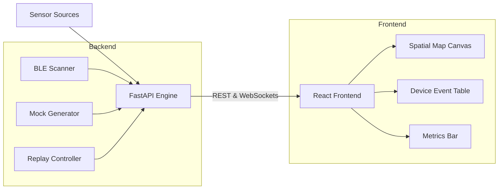

# DeadZone

> Real-time crowd-intelligence platform. **Mock → Replay → Live → Mesh.**

DeadZone is an observability layer for physical spaces. Live crowd density, movement flow, congestion zones, and dead Wi-Fi areas — without attendee apps, accounts, QR codes, or interaction. Passive RF sensing only.

## Features

- **Spatial Intelligence**: Real-time visual heatmaps and drifting device-level particles overlaid on venue floor plans.
- **Multi-Mode Engine**: 
  - `Mock`: Synthetic event generation for guaranteed, repeatable demos.
  - `Replay`: Playback recorded, high-density traffic scenarios (like a stadium ingress or concert exit).
  - `Live (BLE)`: Real-time Bluetooth Low Energy passive scanning and telemetry rendering.
  - `Mesh`: Integration with LoRa relays (Meshtastic) for outdoor or no-Wi-Fi venues.
- **Live Device Telemetry**: Granular observation of sensed MAC hashes, RSSI values, and zone assignments via a WebSocket-powered event stream.
- **Alerting & Diagnostics**: Automated alerts based on density thresholds and real-time mesh link quality.

## Architecture



- **Backend**: Python 3.11, FastAPI, asyncio, WebSockets, Bleak (BLE), Scapy (Wi-Fi passive)
- **Frontend**: React + Vite + TypeScript, custom spatial map (SVG particles)
- **Data Persistence**: Local trace recordings for replay mechanisms.

## Quick Start

### Option 1: Docker (Recommended)

Run the entire stack with a single command:

```bash
docker compose up
```

Then open `http://localhost:3000`. You should see an animated crowd heatmap with a badge indicating the current data mode (Mock by default).

### Option 2: Local Development

If you prefer to run the components separately or work on the codebase:

```bash
# Install all dependencies (frontend & backend)
npm run install:all

# Start both frontend (Vite) and backend (FastAPI) in development mode
npm run dev
```

## Engineering Principles

- **Deterministic first** — Mock mode produces identical visuals every run; judges need a stable demo
- **Aggregate > Identity** — Never display or transmit device identifiers; only density, motion, pressure
- **Event-driven** — `Sensor Event → Aggregation → Spatial Intelligence` everywhere, so replay/sim/ML reuse one pipe
- **Honest provenance** — Mode badge is persistent and color-coded; mocking is labeled, never hidden

## Repo Layout

- `backend/`: FastAPI application, domain models, runtime engine, and data sources (mock, replay, ble).
- `frontend/`: React components, store management, spatial rendering (`SpatialMap.tsx`), and styles.
- `.lev/`: PM and UX specifications, pipelines, and task plans for the agentic development workflow.

## License

Proprietary — Kingly Agency.
