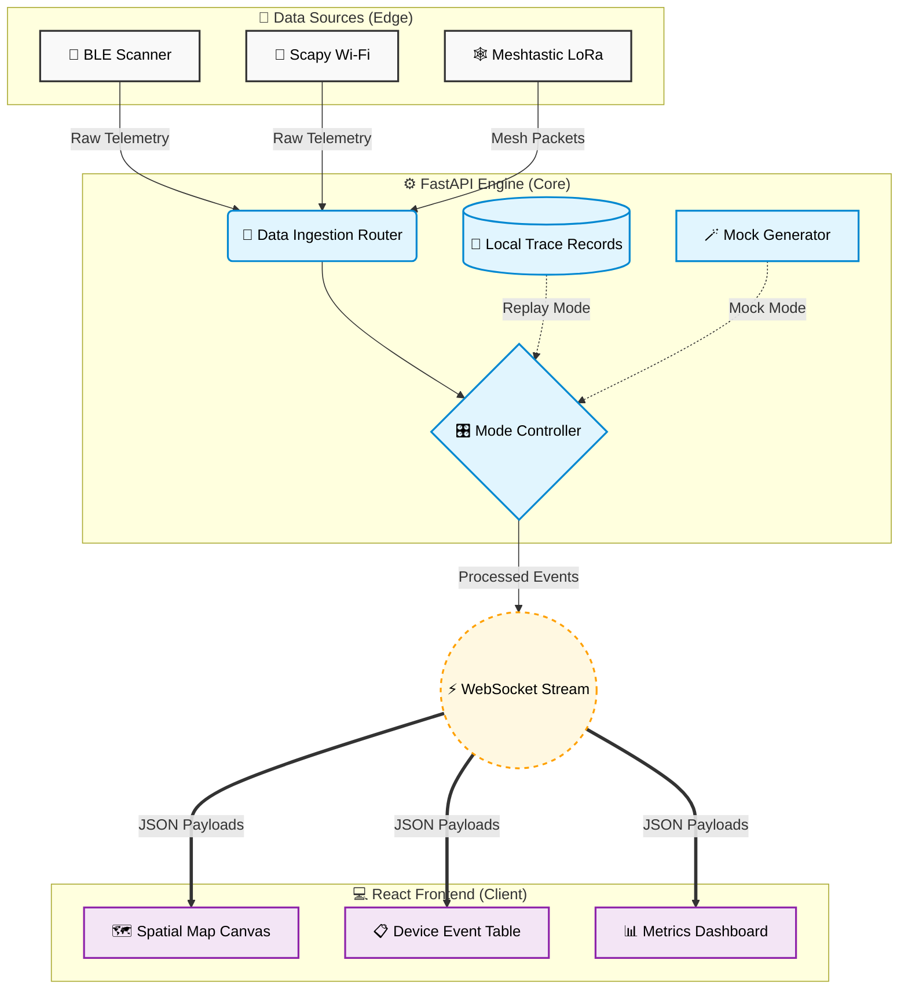
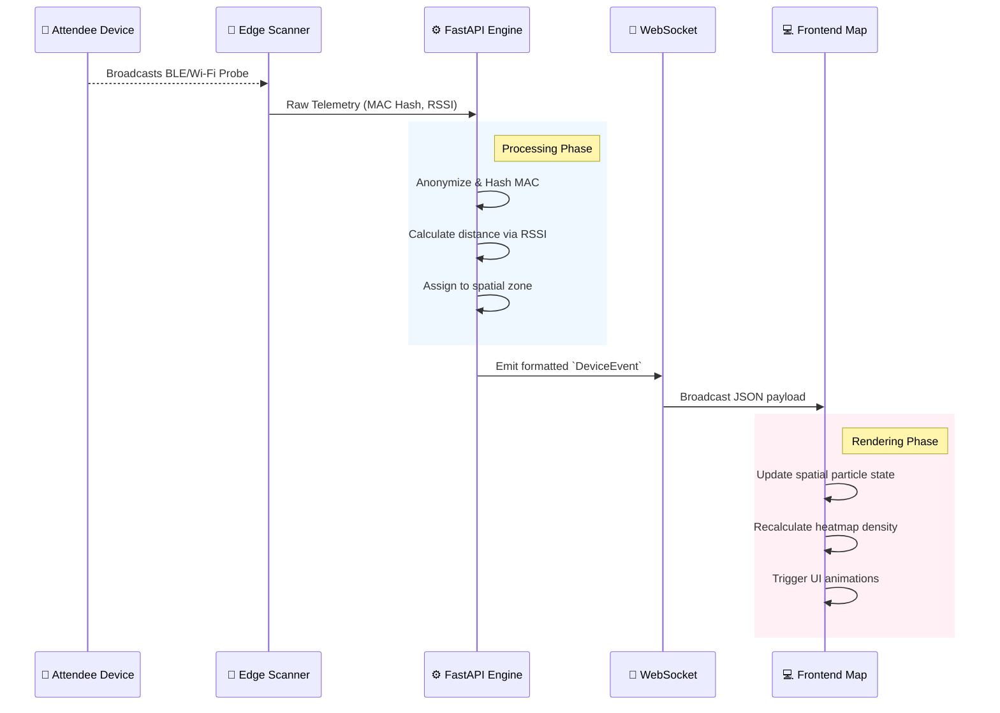
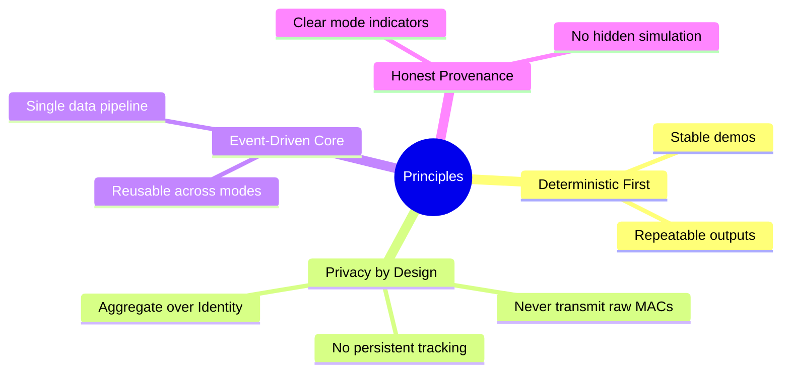

<div align="center">
  <h1>🎯 DeadZone</h1>
  <p><strong>Real-time crowd-intelligence platform. Mock → Replay → Live → Mesh.</strong></p>
  
  <p>
    <a href="#features">Features</a> •
    <a href="#architecture">Architecture</a> •
    <a href="#quick-start">Quick Start</a> •
    <a href="#engineering-principles">Principles</a>
  </p>

  <p>
    
    
    
    
    
  </p>
</div>

<br/>

> **DeadZone** is an observability layer for physical spaces. Live crowd density, movement flow, congestion zones, and dead Wi-Fi areas — without attendee apps, accounts, QR codes, or interaction. Passive RF sensing only.

---

## ✨ Key Features

| Feature | Description |
| :--- | :--- |
| 🗺️ **Spatial Intelligence** | Real-time visual heatmaps and drifting device-level particles overlaid on venue floor plans. |
| 🔄 **Multi-Mode Engine** | Operate seamlessly across `Mock`, `Replay`, `Live (BLE)`, and `Mesh` data sources. |
| 📡 **Live Telemetry** | Granular observation of sensed MAC hashes, RSSI values, and zone assignments via WebSockets. |
| 🚨 **Alerting & Diagnostics** | Automated alerts based on density thresholds and real-time mesh link quality. |

---

## 🏗️ Architecture

DeadZone is built on a modern, decoupled architecture designed for high throughput and low-latency rendering of spatial data.

### System Topology



### Data Flow Sequence

How a device ping is processed and visualized in real-time:



---

## 🚀 Quick Start

### Option 1: Docker (Recommended)

Run the entire stack with a single command:

```bash
docker compose up
```

Then open `http://localhost:3000`. You should see an animated crowd heatmap with a badge indicating the current data mode (Mock by default).

### Option 2: Local Development

If you prefer to run the components separately or work on the codebase:

```bash
# Install all dependencies (frontend & backend)
npm run install:all

# Start both frontend (Vite) and backend (FastAPI) in development mode
npm run dev
```

---

## 🧠 Engineering Principles

We adhere strictly to the following principles to ensure reliability and privacy:



---

## 📂 Repository Structure

| Directory | Description | Technology Stack |
| :--- | :--- | :--- |
| 📁 `backend/` | FastAPI application, domain models, runtime engine, and data sources. | Python 3.11, asyncio, Bleak |
| 📁 `frontend/` | React components, state management, and spatial SVG rendering. | React, TypeScript, Vite |
| 📁 `.lev/` | Project management specifications, task plans, and UX artifacts. | Markdown |

---

<div align="center">
  <p><small>Proprietary — Kingly Agency © 2026</small></p>
</div>
